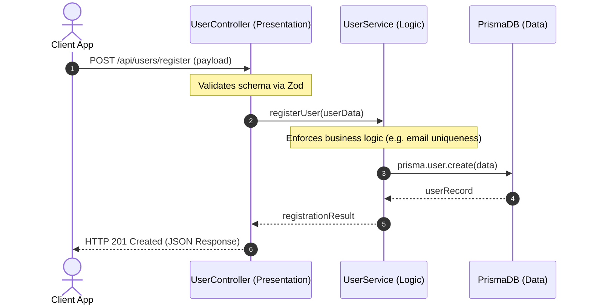
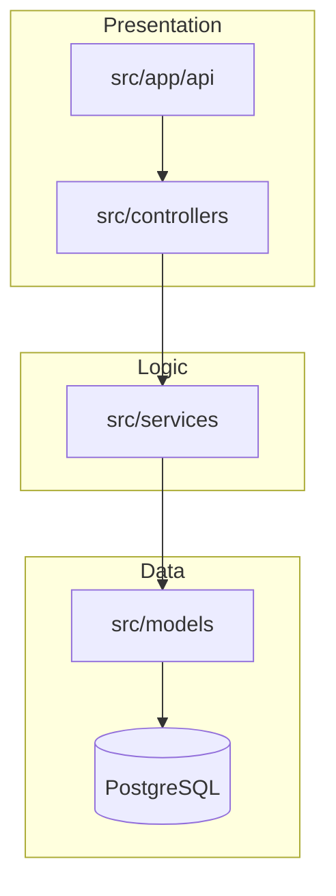

# Component & Layer Integration Map: BookStore API

This document describes how the presentation, business logic, and data layers connect and communicate within the BookStore API project.

## Interaction Flow

## Architecture Diagram

## Communication Patterns

All interaction is synchronous. The HTTP layer (routing) communicates exclusively with controllers. Controllers invoke domain services within the logic layer. Services write to and read from the database using the Prisma ORM client instance. No raw SQL queries were detected in the service or controller layers.
